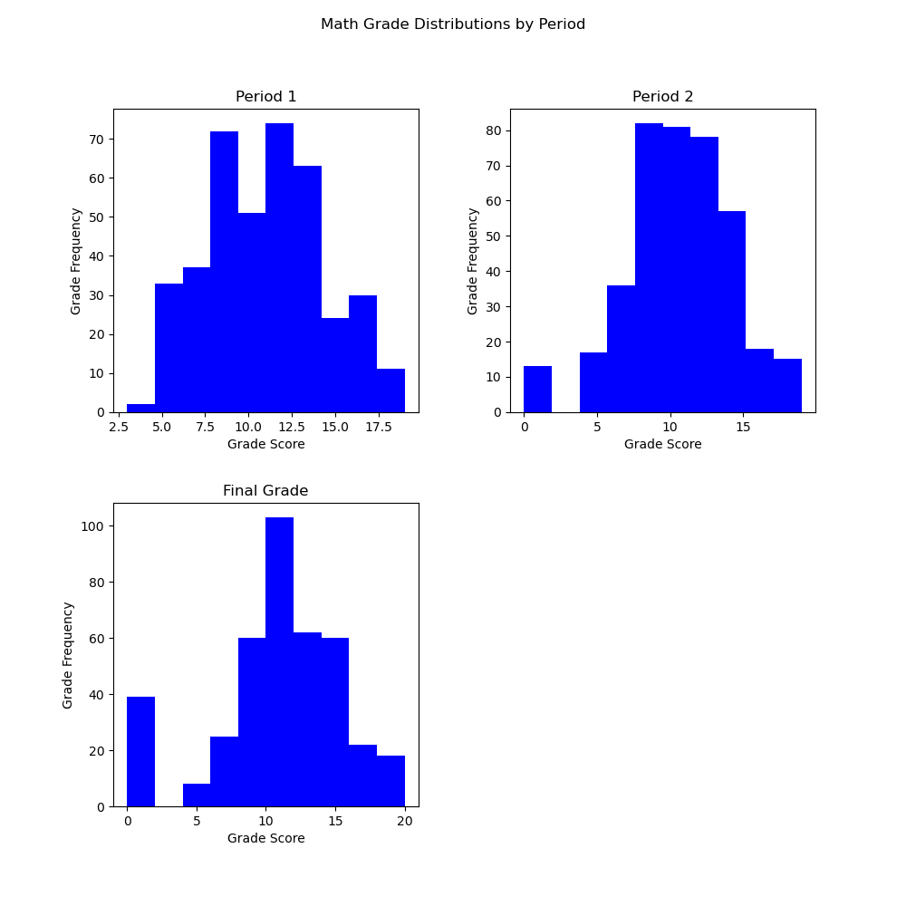
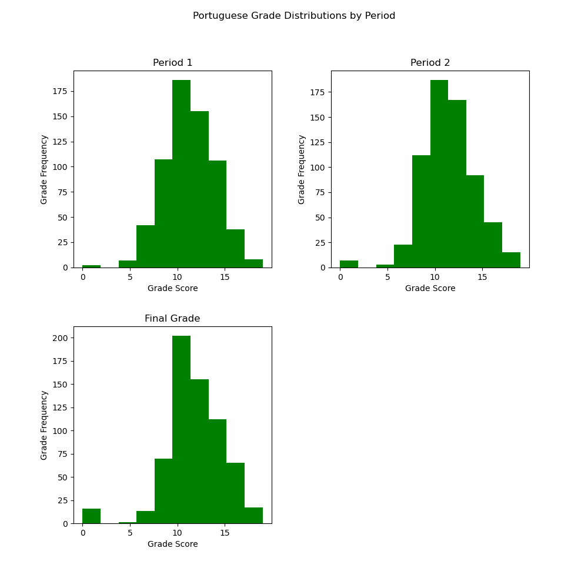
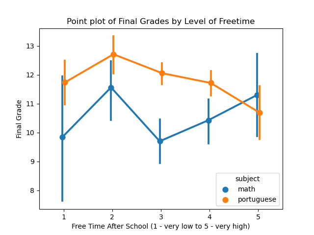
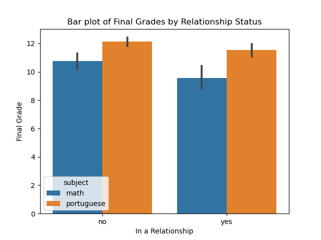
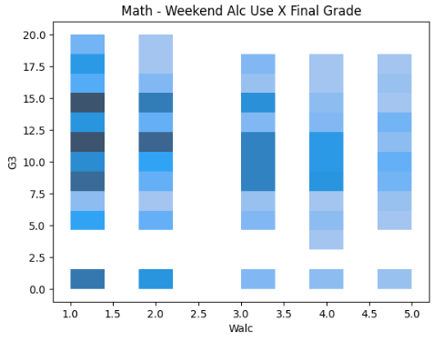
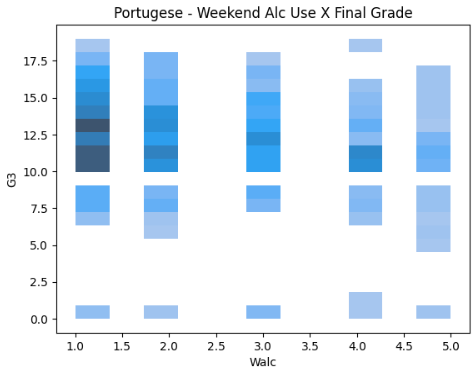
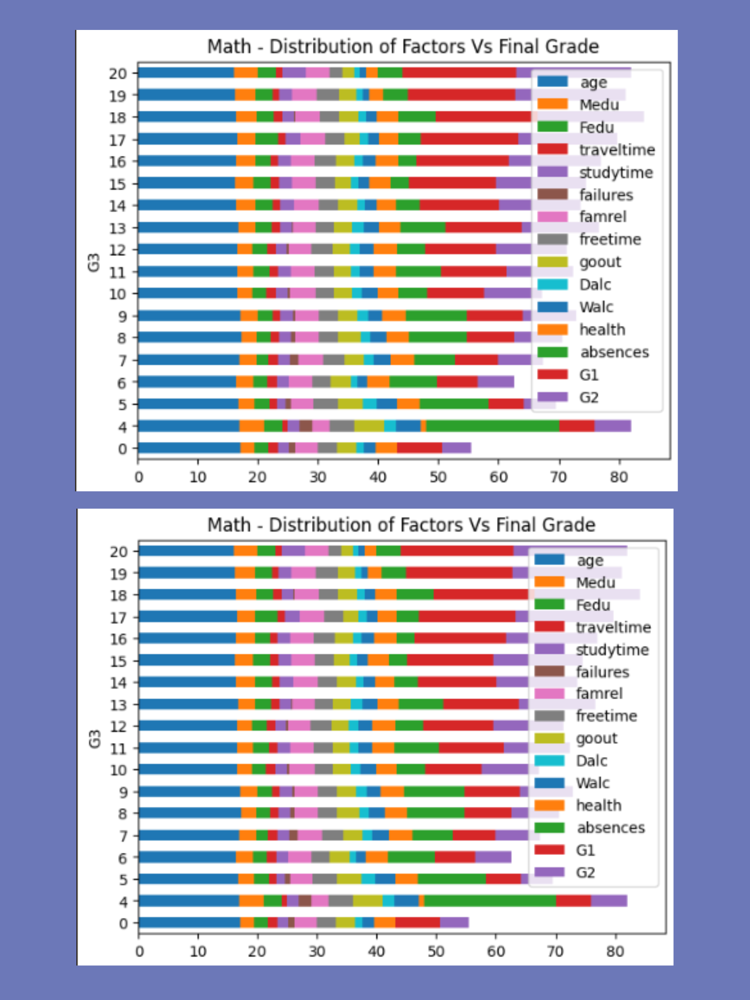

# Final Report

## Introduction

As students ourselves, we have hoped to shed light on the factors and habits that benefit a person's final grade over the course of their education. This motivated us to perform data analysis on a pair of datasets across two different subjects for students in Portuguese secondary schools. Specifically in this analysis we hope to answer questions related to the effects of home environment, leisure activities and alcohol consumption among other factors on a student's academic results. We are eager to show our findings so that they may be used to benefit the education of students in the future.

For more details, [the analysis notebooks and data can be found in the Github Repository here.](https://github.com/ubco-W2022T1-cosc301/project-group05)

## Exploratory Data Analysis

### Grade Distribution Plots

In our EDA we looked at the grade distributions between subjects. Below we can see that grades almost follow a normal distribution, but have some important features worth noting. There is a slight left skew in the final grade distribution for Portuguese indicating that students are more likely to get a high grade in this subject. In Math on the other hand, we can see that our students start out in Period 1 with a somewhat bimodal grade distrubution, and then as the course continues, the vast majority of students start to fall within the middle range, indicated by the strong center. Math also shows a high amount of failures (0 scores) that is indicated a taller bar in the far left end of the graph.

## Question 2 + Results

### Question

What is the relation between leisure and grade performance? Is a relaxed student more likely to perform well, and if so can a moderate amount of personal indulgence be beneficial towards a students academics?

#### Figure 1.

Above is a point plot of the final grades for each subject compared to a student's level of free time. From our analysis we have determined that this plot demonstrates that some moderation of freetime is required for a student to achieve a higher final grade. This is shown by a decrease in final grade as you go from a free time level of 2 to 1 in the point plot for both subjects, though the error makes it more clear for Portuguese.

It is also worth noting in Math, freetime levels 2 and 5 have points with a similar final grade, and in Portuguese points show an increase in their final grade as the level of free time decreases up to 2. Even with the error bars we concluded that for Math it is possible for very relaxed students to achieve comparitively high scores but otherwise students only require at least some amount free time in general before it becomes detrimental.

#### Figure 2.

Above is a strip plot of the student's final grades with their respective levels of weekend alcohol consumption. Our main conclusions from this plot is that there exists a large amount of students that can perform well and drink in moderation on the weekend. This is evident by the frequency of points with a high final grade when x is 2 or 3. However as the level of alcohol consumption increases, these points have a decline in presence. Therefore in this case, relaxed students can perform almost as well in moderation, but of course start to do worse when they have very high levels of weekend alcohol consumption. You can also see from the plotted points, that the students that hardly drink are still the ones that get the best scores.

#### Figure 3.

Figure 3 depicts a bar plot that compares the Final Grade of students that are currently in and not in a romantic relationship. While we cannot definitely say due to the large error bars that students not in a relationship have a clear advantage. It is evident that there is no benefit in being within a relationship when it comes to final grade scores. This means a student's relationship status at best will not impact their scores, but there exists the potential it will decrease their performance suggested by the gap between bars.

You can find the [full analysis notebook for this research question here.](https://github.com/ubco-W2022T1-cosc301/project-group05/blob/main/notebooks/analysis2.ipynb)

### -----------------------------------------------------------------------------------------------------------------------------------------------------------------------
## Nils Kelley - Reflection - Analysis3

### Research Questions + Findings:

-------------------------------------------------------------------------------------------------------------------------------------

### Question 1: ***Given our data, what is the coorelation between alcohol consumption and academic results?***
#### Figure 1

#### Figure 2

    Given the data, there was no clear indiciation between a student's alcohol usage and their academic success. In fact, when comparing the two schools, it became evident that one school had better grades in general than the other, irrespective of alcohol use. That being said, there data also shows a correlation between alchol consumption negatively affecting males grades, while it did not show the same indication for females. I believe that this is due to the fact that the males are more prone to excessive or 'binge' drinking, therefore, affecting their schooling.The finding is especially evident within the tableua visual representation of the dataset, where through the filter, one can easily see the correlation between different attributes.

-------------------------------------------------------------------------------------------------------------------------------------
### Question 2: What distributions or relationships can be mapped to the key factors that infleunce academic success?
#### Figure 3
#### Figure 1

    Given the data, there was no clear indiciation between a student's alcohol usage and their academic success. This was evident with the student with the highest Final Grade (16) having a weekly drinking average of 7.5/10, while another student had a final grade of (8) and a weekly alcohol average of 7.5. There were also many student's that had low alcohol usages, such as 1.5, that also had low final grades, consistently ranging from 7-10. That being said, while the data might not necessarily show it, I do believe, that if we were to analyze a larger data set, such as, all students in a given province, that we would then see a clear pattern between an increased alcohol use resulting in a decrease in academic success. 
-------------------------------------------------------------------------------------------------------------------------------------
    
### Research Question 3: * ***Given our data, what is the coorelation between the use of a student's freetime (studying, going out,  etc..) absences, and their final grade?***
    
    Given the data, there does not seem to be any clear indication between a students use of freetime and their absences. On the one hand, for example, the data shows some students that had a high use of freetime, such as, 7.5 / 10, indicating that they spend most of their freetime to study or go out in relation to the overall amount of freetime that they have, would still have absences of 10+, such as one student with the priorly stated use of freetime statistic having 12 absences. On the other hand, sseveral students with use of freetime averages of less than 4, indicating less studying, going out, and overall freetime can be found having more than 10 absences as well. Such as two students, who had 14 and 15 absences, while having a use of freetime of 2.3 and 3.3; both within the lower quartile. In a sense, this dataset does not tell us much about the correlation between freetime and absences, but I think it tells us a very important thing about high school students: No matter how busy they are, they will always find the time to skip class.

### -----------------------------------------------------------------------------------------------------------------------------------------------------------------------

## Summary / Conclusion

In conclusion we have learned that in terms of moderation and leisure, generally students tend to perform better when they avoid indulging in activities that are unrelated to their studies, but moderately relaxed students, such as those who consume alcohol on the weekend, are capable of performing just as well in most cases. While students may see a decline in grades if they overindulge, having no moderation when it comes to leisure can be detrimental like in the case of free time. 

## CC Attribution

Datasets in Maths.csv and Portuguese.csv files provided by [Aman Chauhan](https://www.kaggle.com/whenamancodes) on kaggle.com under [Attribution 4.0 International (CC BY 4.0)](https://creativecommons.org/licenses/by/4.0/) . 

Link to the material can be found at https://www.kaggle.com/datasets/whenamancodes/student-performance?resource=download. Datasets represent data collection used in the findings of Cortez and Silva, 2008.

The raw data will be modified in order to perform data analysis and present findings for educational purposes.

Citation: Cortez, P., & Silva, A. M. G. (2008). Using data mining to predict secondary school student performance.
